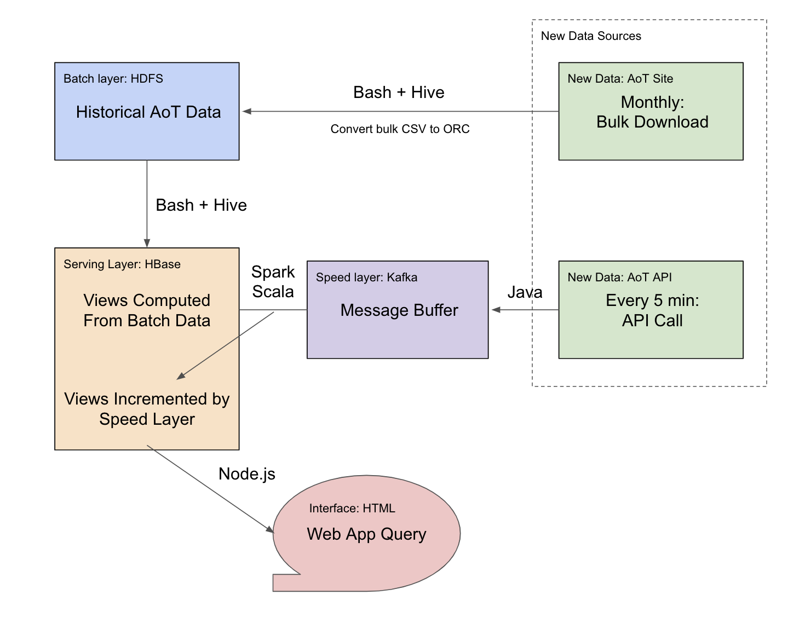
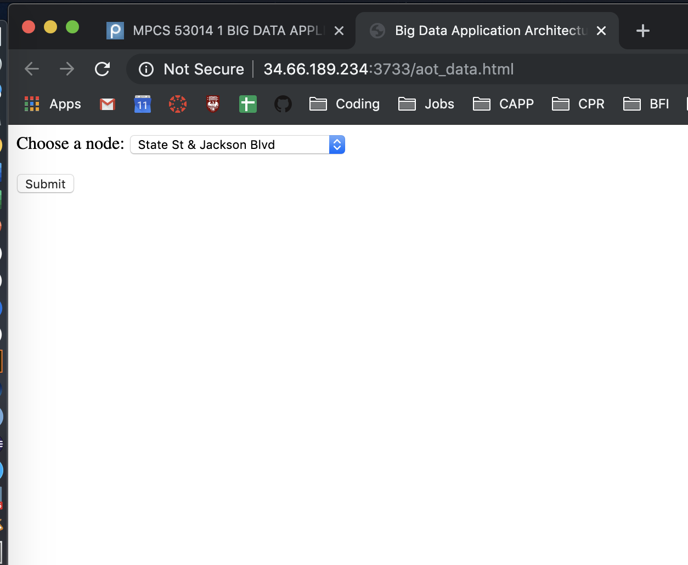
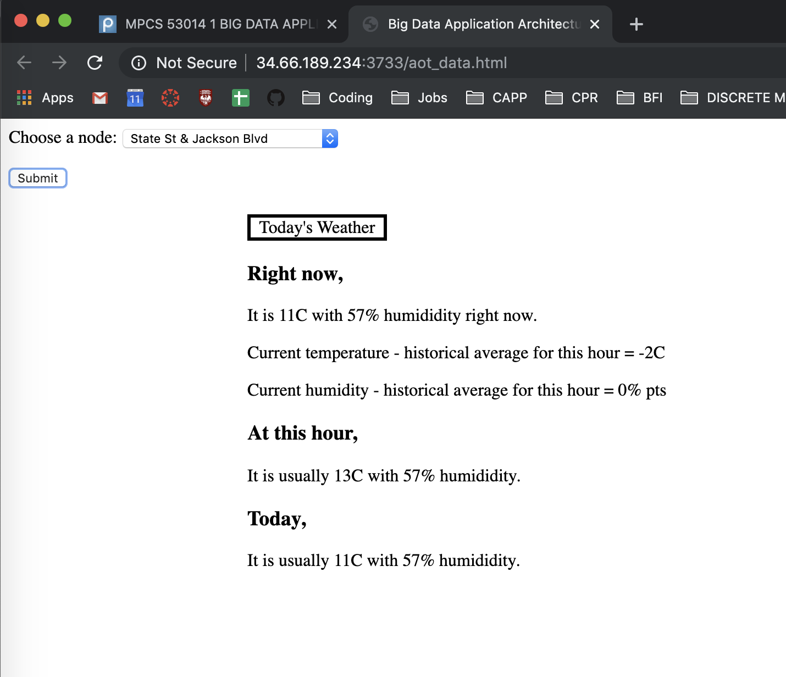

# big-data-AOT

A big data application to check the weather.

## Overview

This project is a toy implementation of a lambda architecture using the Apache stack. Using data from Chicago's Array of Things (AoT) urban sensor network, it implements batch, serving, and speed layers as well as a frontend web app to compare the current weather at a selected sensor node to historical trends.

Languages/platforms used: Hadoop DFS, HBase, HiveQL, Kafka, Spark, Scala, Java, Node.js (see Technical Implementation section below for details)

The project was completed in December 2019 as a final project for the MPCS 53014 Big Data Application Architecture class at the University of Chicago.

## Data Sources

As of December 2019, there are approximately 200 sensors distributed across Chicago and each measures a set of environmental and ambient conditions (e.g. temperature, pressure, noise).

Data is available both via [bulk downloads](https://aot-file-browser.plenar.io/data-sets/chicago-complete) for historical data starting in 2016, as well as via [API](https://aot-file-browser.plenar.io/) for more recent readings from the last 7 days. The API has a 5-minute refresh rate.

## Project Structure

Quick summary of what's what in this repo:

```
.
├── 01-batch: builds master dataset in HDFS
├── 02-batch-ingestion: regularly updates master dataset
├── 03-serving: computes views in HBase
├── 04-speed: increments serving layer views in HBase
│   ├── KafkaIngestAOT: pulls new data from API to Kafka
│   └── SpeedLayerAOT: takes Kafka messages and increments serving layer views
├── 05-webapp: lets user query final HBase serving layer views
└── img: some screenshots of the front end
```

## Technical Implementation



Above is an illustration of the dataflow, from new data sources through the various layers of the lambda architcture to the user iterface.

### Batch Layer

The batch layer holds the master dataset in a Hadoop DFS (HDFS) hosted on a class-provided Google Cloud Platform server. Files are stored in ORC format. The master dataset is created once from bulk historical data `01-batch` contains bash and Hive scripts for creating the master dataset.

While the serving layer views are incremented by the speed layer, more accurate batch update to the master dataset are processed monthly. A cronjob downloads the previous month's bulk data dump, ingests it into HDFS, converts the new data into ORC format and then shifts those files directly to the HDFS store for the master table, avoiding a monthly recompute of the entire master dataset. `02-batch-ingestion` contains bash and Hive scripts for ingesting newer bulk data.

### Serving Layer

The serving layer hosts precomputed views in HBase. A cronjob regularly calls a Hive script that recomputes the historical trend for weather over the past hour and past day. `03-serving` contains bash and Hive scripts for this layer.

### Speed Layer

The speed layer implements a Kafka streaming buffer to mediate between new API data pushes and ingestion to the serving layer views. `04-speed` contains scripts for this layer.

#### AoT API to Kafka: `KafkaIngestAOT`

First, a Java class (`NodeUpdate`) calls the Array of Things API every 5 minutes. A separate Java class (`KafkaObsRecord`) stores the response and sends it as a string to Kafka using the `jonathantan_weather` topic. Finally, we deploy the above via a Spark job.

#### Kafka to HBase: `SpeedLayerAOT`

Second, a Scala object (`StreamAOT`) consumes messages from Kafka, queries the corresponding table in HBase, then combines the two in a `NodeRecord` Scala object. The HBase table is then incremented with the updated view. This was also deployed via a Spark job.

### Web App

Finally, the (fairly barebones) web frontend provides an interface where users may select a node from a dropdown menu and see how the current weather compares to historical trends for that hour and day of the year. `05-webapp` holds scripts for this layer.

Some (again barebones) screenshots of the interface below:

1. Initial interface before selection



2. After selecting a node


